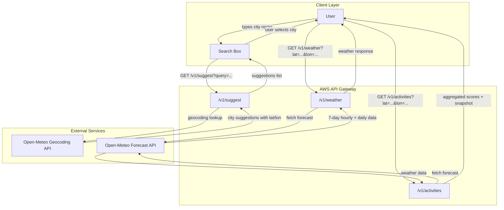
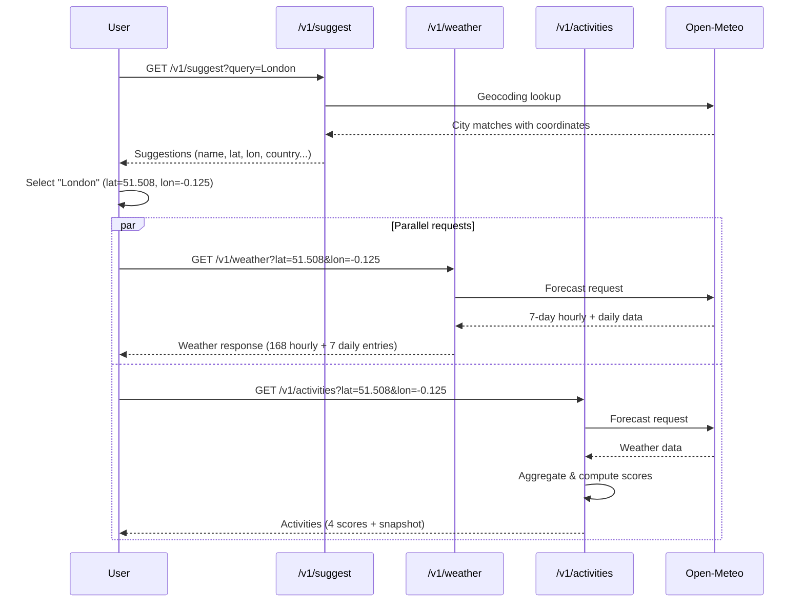
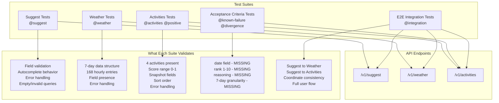
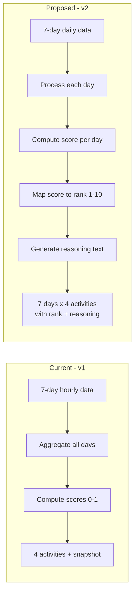
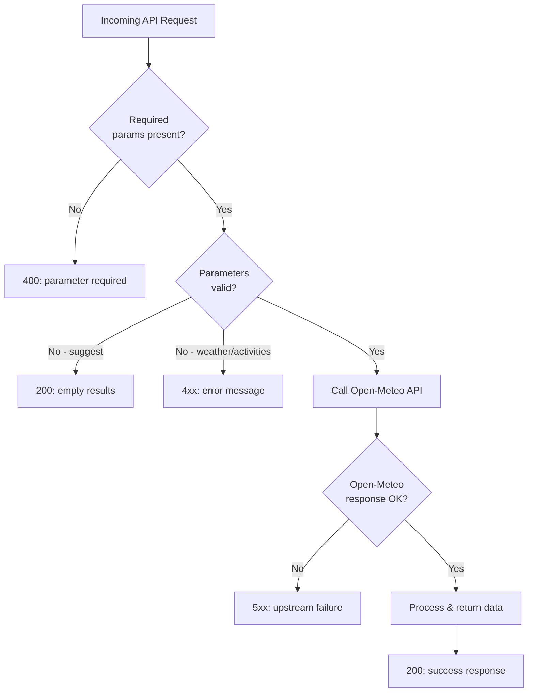

# System Flowchart — Activity Ranking API

## 1. Current System Architecture

## 2. Data Flow per Request

## 3. Test Coverage Map

This diagram shows which test suites cover which parts of the system.

## 4. Proposed v2 Architecture Change

## 5. Error Handling Flowchart

